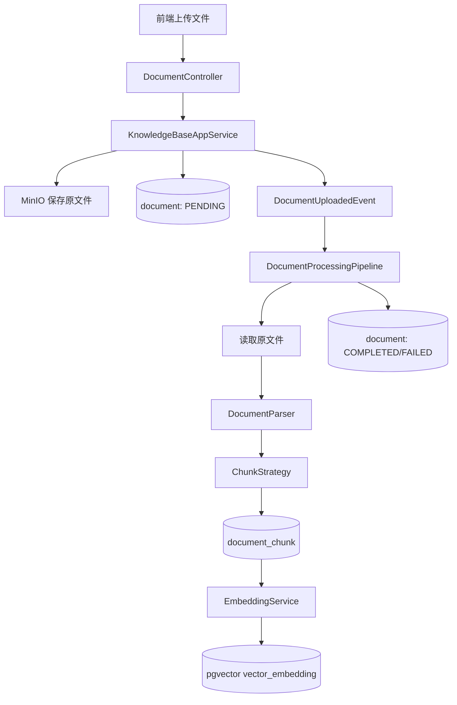

# AI Knowledge Agent 项目分析报告

生成时间：2026-05-30

## 0. 项目概览

本项目是一个企业知识库 AI Agent 平台，采用“Spring Boot 后端单体 + Vite React 前端”的仓库结构。后端主要覆盖知识库管理、文档上传与处理、模型配置、RAG 问答、Agent 执行和工具管理；前端提供知识库、文档、模型、工具、Agent、RAG 问答，以及部分工作流/定时任务/会话页面。

当前代码呈现出明显的 MVP/演进中状态：核心 RAG 与 Agent 链路已经成型，但部分前端功能明显超出后端 API 实现范围；认证、权限、多租户、任务可靠性、观测性、测试和生产化配置仍较薄弱。源码和配置中的中文注释存在编码乱码，已经影响可读性和维护效率。

## 1. 系统架构分析

### 1.1 总体架构

项目整体为单体应用架构：

- 前端：`web/`，Vite + React + TypeScript + TailwindCSS，开发环境通过 Vite proxy 将 `/api` 转发到 `localhost:8080`。
- 后端：`src/main/java`，Spring Boot 3.2 + Java 21，提供 REST API。
- 数据库：PostgreSQL，业务数据通过 MyBatis-Plus 访问；向量检索使用 pgvector + LangChain4j `PgVectorEmbeddingStore`。
- 对象存储：MinIO，用于保存上传的原始文档。
- 缓存：Caffeine 用于动态模型实例缓存；Redis 依赖和配置存在，但从已读代码看核心链路使用不明显。
- AI 框架：LangChain4j，用于 Chat/Embedding 模型、pgvector 存储、AiServices 工具调用等。
- 异步处理：文档上传后发布 Spring ApplicationEvent，由监听器/异步配置触发文档处理管线。

### 1.2 后端分层

后端包结构有较清晰的 DDD/分层倾向：

- `api`：REST Controller 与请求/响应 DTO。
- `application`：应用服务，编排业务流程，如知识库、文档、RAG、Agent、模型管理。
- `domain`：领域模型、事件和领域服务接口，如 Agent 上下文、执行步骤、文档状态、处理管线。
- `infrastructure`：AI 模型工厂、RAG 检索、解析器、分块策略、持久化、MinIO、工具执行器、配置等。
- `common`：统一结果、异常、错误码、用户上下文。

这套分层方向是好的，但部分职责边界仍混杂：例如 Controller 直接使用 Mapper 创建 Agent，`domain.knowledge.service.DocumentProcessingPipeline` 实际依赖大量 application/infrastructure 组件，更像应用编排服务而非纯领域服务。

### 1.3 核心业务模块

- 认证模块：`AuthController` + `AuthAppService` + `AuthInterceptor`，当前使用固定 mock token。
- 知识库模块：知识库 CRUD、文档上传、文档列表/详情/状态、文档删除。
- 文档处理模块：MinIO 读取、文档解析、分块、chunk 持久化、embedding、pgvector 入库、状态流转。
- 模型模块：模型提供商与模型配置 CRUD，动态解析默认提供商和模型。
- RAG 模块：问题改写、混合检索、重排、LLM 生成答案。
- Agent 模块：Agent 配置、运行记录、Plan-Execute 执行、AiServices 执行、工具注册/执行。
- 工具模块：HTTP/SQL 等动态工具定义与执行。

## 2. 前端架构分析

### 2.1 技术栈

前端位于 `web/`：

- React 18 + TypeScript 4.9。
- Vite 4，`@` alias 指向 `src`。
- React Router v6 负责路由。
- Zustand 管理认证状态。
- Axios 封装统一请求层。
- TailwindCSS + lucide-react + sonner。
- Vitest/jsdom 已配置，但未看到明显测试覆盖。

### 2.2 目录结构

前端结构按功能页组织：

- `components/common`：表格、分页、弹窗、搜索、状态标签、错误边界等通用组件。
- `components/layout`：Header、Sidebar、Layout。
- `pages/knowledge-base`：知识库、文档详情。
- `pages/model-provider`：模型提供商与模型配置。
- `pages/tools`：工具管理。
- `pages/agents`：Agent 列表、运行记录、运行详情。
- `pages/qa`：RAG 问答页面。
- `pages/workflows`、`pages/jobs`、`pages/conversations`：存在页面与 service，但后端对应实现不完整或未发现。
- `services`：按资源封装 API 请求。
- `types`：前端类型定义。
- `utils/request.ts`：Axios 实例、token 注入、响应拆包、401 清理认证。

### 2.3 路由与认证

前端所有主页面包在 `ProtectedRoute` 中，登录后才可访问。认证状态由 Zustand 保存，请求时将 token 写入 `Authorization: Bearer <token>`。

风险点：认证仍依赖后端固定 mock token；前端本地状态与真实会话生命周期、刷新恢复、过期处理、安全存储等尚未生产化。

### 2.4 API 封装一致性

`request.ts` 假设后端统一响应格式为：

```ts
{ code: 200, message: string, data: T }
```

成功时直接返回 `data`。这与后端 `Result` 设计基本匹配。

但前端存在较多“产品完整态”的页面和 service，例如 workflow、job、conversation，而后端当前已读 API 主要集中在 auth、knowledge-base、document、model、qa、agent、tool。这意味着部分页面可能依赖 mock 数据或调用不存在的接口，后续联调会出现断层。

### 2.5 前端主要问题

- 页面级组件较大，如 `ToolList.tsx`、`KnowledgeBaseDetail.tsx`、`LoginPage.tsx` 等，状态、表单、请求和展示逻辑耦合偏高。
- 缺少统一的数据请求缓存层，所有请求多由页面自行驱动，复杂页面容易出现重复加载、竞态和错误处理不一致。
- API 类型由前端手写，缺少后端 OpenAPI/契约生成机制，前后端字段漂移风险较高。
- 工作流、定时任务、会话等页面与后端能力存在落差，应明确是 mock、规划中还是废弃。
- 编码乱码同样出现在前端注释中，影响维护。

## 3. 后端架构分析

### 3.1 技术栈与基础设施

后端使用：

- Spring Boot 3.2.0，Java 21。
- MyBatis-Plus 3.5.7 作为主要 ORM。
- Spring Data JPA 引入并设置 `ddl-auto: update`，注释表明可能用于自动建表，但业务查询主要由 MyBatis-Plus 承担。
- PostgreSQL + pgvector。
- MinIO 存储原始文档。
- LangChain4j 0.36.2。
- Caffeine 模型实例缓存。
- Quartz、Redis 依赖存在，但核心实现不明显。

### 3.2 API 层

主要 Controller：

- `/api/auth/login`：登录。
- `/api/knowledge-bases`：知识库 CRUD。
- `/api/documents`：上传、列表、详情、状态、删除。
- `/api/models`：模型提供商和模型配置。
- `/api/qa`：RAG 问答。
- `/api/agents`：Agent 创建、执行、查询运行状态。
- `/api/tools`：工具管理。

API 设计整体简单直接，适合 MVP。但部分 Controller 仍直接访问 Mapper 或手写业务逻辑，例如 `AgentController.create` 直接插入 `AgentDO`，建议统一收敛到应用服务层。

### 3.3 应用层

应用层承担主要编排：

- `KnowledgeBaseAppService`：知识库、文档上传、文档列表/详情/删除。
- `DocumentProcessingService`：文档解析与分块公共能力。
- `DocumentChunkAppService`：chunk 替换式存储。
- `DocumentEmbeddingAppService`：embedding 与向量入库。
- `RagAppService`：RAG 问答总编排。
- `AgentAppService`：Agent 执行总编排。
- `ModelAppService`：模型配置管理。

整体职责较清晰，但 RAG/Agent 逻辑中存在较多硬编码 prompt、正则、降级文案，建议沉淀为可配置模板与策略组件。

### 3.4 持久化与数据模型

已读实体包括：

- `UserDO`
- `KnowledgeBaseDO`
- `DocumentDO`
- `DocumentChunkDO`
- `ModelProviderDO`
- `ModelConfigDO`
- `AgentDO`
- `AgentRunDO`
- `ToolDefinitionDO`
- `AiCallLogDO`

业务数据通过 MyBatis-Plus Mapper 操作。向量数据主要交给 LangChain4j PgVectorEmbeddingStore 管理，表名由配置 `knowledge-agent.vector-store.table-name` 控制，默认为 `vector_embedding`。业务 chunk 表与向量表通过 metadata 中的 `chunk_id`、`knowledge_base_id` 关联。

### 3.5 配置问题

`application.yml` 当前包含本地数据库密码、MinIO 默认账号、DEBUG 日志、JPA 自动更新表结构等开发配置。生产环境应拆分 profile，并使用环境变量或密钥管理。

`pom.xml` 中 PostgreSQL driver 被声明了两次，一次 runtime scope，一次指定版本，属于依赖治理债务。

## 4. Agent 架构分析

### 4.1 Agent 两种执行策略

当前 Agent 支持两种执行策略：

- `PLAN_EXECUTE`：手写规划-执行-推理循环。
- `AI_SERVICES`：基于 LangChain4j AiServices 的 ReAct/Function Calling 风格执行。

`AgentAppService.run` 根据 `ExecutionStrategy` 分派。

### 4.2 Plan-Execute 链路

Plan-Execute 模式流程：

1. 校验 Agent 配置存在。
2. 创建 `agent_run` 运行记录，初始状态 `PLANNING`。
3. 创建 `AgentContext`，注入默认 memory。
4. `AgentPlanner.plan(task)` 生成 `PlanStep` 列表。
5. 循环调用 `AgentReasoner.reason(context)` 决策：`CONTINUE`、`FINAL_ANSWER`、`RETRY`、`ABORT`。
6. 对 `CONTINUE` 执行下一个 `PlanStep`，由 `AgentExecutor.executeStep` 调用工具。
7. 每一步写入上下文，最终序列化步骤日志到 `agent_run.log`。
8. 达到最大步数或异常时标记失败。

优点：可控性强，便于记录步骤和调试。缺点：Planner/Reasoner/Executor 的协议稳定性高度依赖 LLM 输出格式；重试、幂等、超时、工具权限、可观测性还不够强。

### 4.3 AiServices 链路

AiServices 模式流程：

1. 校验 Agent 配置。
2. 创建并更新 run 状态为 `EXECUTING`。
3. 构建 `AgentAiService`，注入 ChatLanguageModel、system prompt、DynamicToolProvider、chat memory。
4. 调用 `aiService.chat(task)`，由 LangChain4j 决定工具调用和最终回答。
5. 记录最终答案。

优点：代码量少，利用框架完成 ReAct 循环。缺点：当前 step 详情为空，工具调用过程缺少结构化审计；与 Plan-Execute 的运行记录语义不一致。

### 4.4 工具体系

工具由数据库配置化，`ToolRegistry` 提供可用工具列表，`DynamicToolProvider` 转换为 LangChain4j `ToolSpecification` 和 ToolExecutor 映射。底层执行器由 `ToolExecutorFactory` 分派，已见 HTTP、SQL 等工具方向。

需要重点关注：

- 工具 schema 能力较弱，`ToolSpecification` 当前只设置 name/description，未充分表达参数 JSON schema。
- SQL 工具具备高风险，需要严格权限、只读控制、SQL 注入防护、超时和审计。
- HTTP 工具需要 SSRF 防护、域名白名单、超时、响应大小限制和敏感头过滤。

### 4.5 Agent 架构主要风险

- 两套 Agent 执行路径并存，抽象尚未统一，运行记录、日志、步骤、错误模型不一致。
- Agent memory 当前为默认内存，未看到持久化会话记忆闭环。
- Agent 创建逻辑部分绕过应用层，后续权限、校验、审计容易遗漏。
- 工具参数解析失败时返回空 Map，可能导致工具误执行或错误不明显。

## 5. RAG 架构分析

### 5.1 文档入库链路

文档入库流程如下：

1. 前端上传文件到 `/api/documents/upload`。
2. `KnowledgeBaseAppService.uploadDocument` 校验文件和扩展名。
3. 文件上传到 MinIO。
4. 创建 `document` 记录，状态为 `PENDING`。
5. 发布 `DocumentUploadedEvent`。
6. `DocumentProcessingPipeline` 执行四阶段处理：解析、分块、embedding、完成标记。
7. 解析阶段从 MinIO 读取文件字节，根据扩展名选择解析器。
8. 分块阶段使用 LangChain4j 分块策略或其他策略，写入 `document_chunk`。
9. embedding 阶段调用动态 embedding 模型，写入 pgvector，metadata 包含 chunk 和知识库信息。
10. 完成阶段更新文档状态、chunk 数和耗时。

支持文件扩展名包括 pdf、doc、docx、txt、md、xlsx、xls、ppt、pptx。

### 5.2 检索链路

RAG 问答流程：

1. `/api/qa` 接收 question、knowledgeBaseId、conversationId。
2. 校验知识库存在。
3. 使用正则识别闲聊/非知识库问题，短路调用 LLM。
4. `QueryRewriteService` 调用 LLM 改写查询，失败则回退原问题。
5. `HybridSearchService` 执行混合检索。
6. 语义检索：`SemanticSearchService` 生成 query embedding，使用 pgvector 检索。
7. 全文检索：`FullTextSearchService` 使用 PostgreSQL `to_tsvector('simple')` + `plainto_tsquery('simple')`。
8. 融合：使用 RRF 合并向量结果和 BM25/全文结果。
9. fallback：改写查询结果不足时，用原始 query 补充检索。
10. `RerankService` 用语义分、词覆盖、短语匹配、IDF、位置分进行多因子重排。
11. `RagAppService.generateAnswer` 将 top results 拼成上下文，调用 LLM 生成答案。
12. 无结果时返回固定未找到文案。

### 5.3 RAG 优点

- 入库链路完整，具备状态机、失败标记和 embedding 重试。
- 检索层支持向量 + 全文混合检索，比纯向量更稳。
- 支持 query rewrite 和 fallback，召回鲁棒性较好。
- 支持按知识库过滤，也支持 knowledgeBaseId 为空时全库检索。
- LLM 失败时有文本拼接降级答案。

### 5.4 RAG 主要问题

- `conversationId` 参数当前基本未参与上下文管理，多轮问答能力尚未真正实现。
- 全文检索使用 PostgreSQL `simple` 配置，对中文分词效果有限；虽然引入 Jieba，但主要用于 rerank，不用于 DB 全文索引。
- Query rewrite、系统 prompt 和闲聊正则硬编码在代码中，且存在编码乱码，难以维护和评估。
- RRF 融合后使用 RRF 分数覆盖原相似度，随后 rerank 又把该分数当 semantic similarity，语义分含义被改变。
- 向量维度配置固定为 1024，若更换 embedding 模型维度不匹配，会导致入库/检索失败。
- 文档删除清理 chunk 和向量，但知识库删除目前不级联删除文档、chunk、向量和 MinIO 文件。
- 文档详情直接从 MinIO 读取文件内容，对 PDF/Office 文件可能不是用户可读文本，且大文件会带来性能风险。

## 6. 数据流分析

### 6.1 登录与请求数据流

```mermaid
flowchart LR
  U[用户] --> FE[React 前端]
  FE -->|POST /api/auth/login| BE[Spring Boot]
  BE --> FE
  FE -->|保存 token| Store[Zustand Auth Store]
  FE -->|Authorization: Bearer token| API[/api/**]
  API --> Auth[AuthInterceptor]
  Auth --> Ctx[UserContextHolder]
```

当前 token 是 mock 固定值，用户 ID 固定为 1。

### 6.2 文档入库数据流



### 6.3 RAG 问答数据流

```mermaid
flowchart TD
  FE[QAPage] --> QA[/api/qa]
  QA --> Rag[RagAppService]
  Rag --> Chitchat{闲聊?}
  Chitchat -->|是| Chat[Chat Model]
  Chitchat -->|否| Rewrite[QueryRewriteService]
  Rewrite --> Hybrid[HybridSearchService]
  Hybrid --> Vector[SemanticSearchService / pgvector]
  Hybrid --> BM25[FullTextSearchService / PostgreSQL FTS]
  Vector --> RRF[RRF Fusion]
  BM25 --> RRF
  RRF --> Rerank[RerankService]
  Rerank --> Prompt[拼接上下文]
  Prompt --> LLM[Chat Model]
  LLM --> Resp[QaResp]
```

### 6.4 Agent 执行数据流

```mermaid
flowchart TD
  FE[Agent 页面] --> Run[/api/agents/{id}/run]
  Run --> App[AgentAppService]
  App --> Strategy{ExecutionStrategy}
  Strategy -->|PLAN_EXECUTE| Plan[AgentPlanner]
  Plan --> Reason[AgentReasoner]
  Reason --> Exec[AgentExecutor]
  Exec --> Tools[ToolExecutor]
  Tools --> Reason
  Reason --> Record[(agent_run)]
  Strategy -->|AI_SERVICES| AiSvc[LangChain4j AiServices]
  AiSvc --> Provider[DynamicToolProvider]
  Provider --> Tools
  AiSvc --> Record
```

## 7. 技术债务分析

### 7.1 编码与可读性债务

- 大量中文注释、日志、prompt、配置注释出现乱码，严重影响维护。
- `pom.xml` 描述和注释乱码。
- prompt 硬编码在 Java 字符串中，且乱码后很难判断真实行为。

建议优先统一项目文件编码为 UTF-8，修复乱码注释和 prompt，并将 prompt 外置到 `resources/prompts` 下统一管理。

### 7.2 架构边界债务

- Controller 中仍有直接 Mapper 操作，应下沉到 application service。
- `domain` 包中存在强依赖基础设施的服务，领域层纯度不足。
- Agent 两套执行路径缺少统一运行事件模型。
- RAG 编排服务承担过多职责，检索、prompt、生成、降级策略可以进一步拆分。

### 7.3 配置与环境债务

- `application.yml` 写死本地数据库、密码、MinIO 密钥。
- `ddl-auto: update` 不适合生产环境。
- DEBUG 日志默认开启，AI 调用和检索日志可能泄露敏感问题/文档内容。
- PostgreSQL 依赖重复声明。
- 缺少 Docker Compose 或环境启动说明，README 基本为空。

### 7.4 数据一致性债务

- 知识库删除未级联清理文档、chunk、向量、MinIO 文件。
- 文档处理 pipeline 中部分步骤跨 MinIO、DB、外部模型、pgvector，不具备真正分布式事务；失败恢复策略有限。
- embedding 阶段使用 `Thread.sleep` 做重试，会占用工作线程。
- pgvector 表由 LangChain4j 管理，业务表与向量表之间缺少显式约束。

### 7.5 安全债务

- 认证为 mock token，用户固定为 1。
- 未看到角色/权限模型。
- 模型 API key、MinIO 密钥、数据库密码处理不安全。
- SQL/HTTP 工具风险高，需要沙箱、白名单、审计、超时、限流。
- 文件上传只校验扩展名，缺少 MIME、文件大小、恶意内容、压缩炸弹等防护。

### 7.6 测试债务

- 前后端都配置了测试依赖/脚本，但未看到与核心链路匹配的测试体系。
- RAG 召回质量、query rewrite、rerank、Agent 工具执行缺少评测集和回归测试。
- 文档解析、分块、向量维度切换、模型配置错误等关键异常缺少自动化保障。

## 8. 风险分析

### 8.1 高风险

- 认证与权限未生产化：任何拿到 mock token 的请求都被视为用户 1，无法支撑真实用户隔离。
- 工具执行安全风险：SQL/HTTP 工具若开放给 Agent，可能造成数据泄露、SSRF、越权查询或破坏性操作。
- 配置泄露风险：数据库密码、MinIO 密钥和本地 endpoint 写在默认配置中。
- 知识库删除不级联：会产生孤儿文档、孤儿 chunk、孤儿向量和对象存储垃圾，长期影响检索质量和成本。
- 编码乱码影响 prompt：RAG/Agent prompt 如果运行时也是乱码，可能直接导致模型行为不可控。

### 8.2 中风险

- 前后端能力不对齐：workflow/job/conversation 页面可能调用未实现 API，影响交付体验。
- 向量维度固定：切换 embedding 模型时容易出现维度不匹配。
- 混合检索分数语义混乱：RRF 分数与语义相似度混用，可能使 rerank 权重失真。
- 文档处理可靠性不足：服务重启、线程池满、模型调用失败、MinIO 临时故障都可能导致状态卡住。
- JPA `ddl-auto:update` 与 MyBatis 并存：表结构不可控，生产迁移风险较高。

### 8.3 低到中风险

- README 缺失，团队 onboarding 成本高。
- 日志过多且包含用户问题/文档内容，存在隐私和合规隐患。
- 前端大型页面组件维护成本上升。
- API 契约手写，字段变更易破坏联调。

## 9. 重构建议

### 9.1 第一优先级：稳定性与安全基线

- 修复全项目 UTF-8 编码问题，尤其是 prompt、错误文案、日志和配置注释。
- 将 `application.yml` 拆分为 `dev/test/prod` profile，敏感信息全部环境变量化。
- 替换 mock token 为 JWT 或 session 机制，补齐用户、角色、权限和资源归属校验。
- 为 SQL/HTTP 工具增加安全沙箱：只读 SQL、库表白名单、请求域名白名单、超时、响应大小限制、审计日志。
- 禁止生产环境使用 `ddl-auto:update`，引入 Flyway/Liquibase 管理数据库迁移。

### 9.2 第二优先级：RAG 链路重构

- 将 prompt 从 Java 字符串迁移到 `src/main/resources/prompts`，建立版本、变量和测试样例。
- 明确 query rewrite、retrieval、fusion、rerank、generation 的接口边界，便于替换策略。
- 修正 RRF 与 rerank 分数语义：保留原 vector score、bm25 score、rrf score，并在 rerank 中显式使用。
- 为中文全文检索引入更合适的分词/索引策略，或将 BM25 服务抽象出来以支持 Elasticsearch/OpenSearch。
- 补齐 conversationId 多轮上下文能力，明确会话表、消息表、上下文截断和隐私策略。
- 为 RAG 建立小型评测集，覆盖召回率、答案忠实性、无答案拒答、中文问题改写等。

### 9.3 第三优先级：Agent 架构统一

- 抽象统一的 Agent Run Event 模型：plan、tool_call、observation、reasoning、final_answer、error。
- 让 Plan-Execute 与 AiServices 都写入同一种结构化事件日志，前端运行详情页可统一展示。
- 将工具参数 schema 完整写入 ToolSpecification，避免只靠自然语言 description。
- 将 Agent 配置创建/更新全部收敛到 `AgentAppService`，统一校验、权限和审计。
- 为工具执行增加幂等键、超时、取消、失败分类和重试策略。

### 9.4 第四优先级：文档处理与数据治理

- 文档处理从本地异步事件升级为可靠任务队列或持久化任务表，支持重试、恢复、取消和人工重跑。
- 删除知识库时提供明确策略：禁止删除非空知识库，或级联删除文档、chunk、向量和 MinIO 文件。
- 文档详情改为读取解析后的文本或 chunk，而不是直接读取原文件内容。
- 文件上传增加大小限制、MIME 检测、病毒扫描/安全扫描、重复文件检测。
- 记录 embedding 模型 ID、维度和版本，支持不同知识库使用不同 embedding 配置。

### 9.5 第五优先级：前端工程化

- 清理或标记 workflow/job/conversation 等未闭环模块，避免误导用户和测试。
- 引入 OpenAPI 生成前端类型和 client，降低接口漂移。
- 将大型页面拆为 hooks、容器组件、表单组件和展示组件。
- 引入 TanStack Query 或类似数据请求层，统一缓存、加载、错误、重试和失效刷新。
- 为核心页面补充组件测试和服务层 mock 测试。

### 9.6 建议的阶段性路线图

1. 第 1 周：修复编码、补 README、拆环境配置、移除敏感默认值、清理重复依赖。
2. 第 2 周：认证权限生产化，工具安全基线，知识库/文档删除一致性修复。
3. 第 3-4 周：RAG prompt 外置、检索分数结构化、conversation 多轮上下文、RAG 评测集。
4. 第 5-6 周：Agent 事件日志统一、工具 schema 完善、运行详情前后端联调。
5. 第 7 周以后：任务队列化、OpenAPI 契约生成、前端大型页面拆分、持续评测和观测平台。

## 10. 总结

项目已经具备企业知识库 AI Agent 平台的核心骨架：文档入库、向量检索、混合召回、LLM 回答、动态模型、Agent 工具调用等关键能力都能在代码中找到实现。当前最大的问题不是方向错误，而是工程化闭环尚未完成：认证权限、安全边界、可靠任务、数据一致性、前后端契约、测试评测和编码质量需要尽快补齐。

建议近期不要急于继续扩展新页面或新 Agent 能力，而应先把 RAG 入库/检索/问答和 Agent 工具执行两条主链路打磨成可观测、可恢复、可评测、可安全上线的稳定底座。这个底座一旦稳住，后续工作流、定时任务、多 Agent 协作和企业级权限都会更容易自然生长出来。
